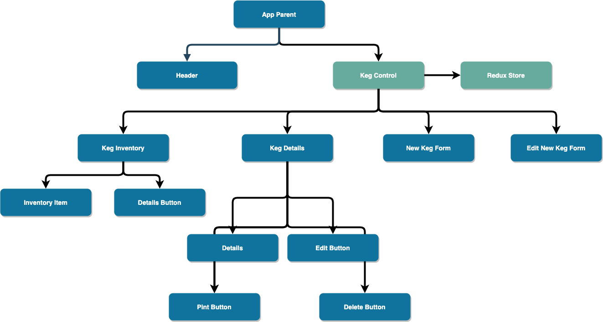

# Tap Room Inventory

#### A web application to help tap room workers manage their keg inventory.

#### By K. Wicz

## Components Hierarchy

## Site Components Wireframe

## User Stories

|Component|Story|
|:---:|:---|
||As a user, I want to immediately be able to see all my available kegs upon loading the page. I also want immediate access to a form to add a new keg, sell a pint from an existing keg, and view a keg's details.|
||As a user, I want to be able to add a name, a brand, a description, alcohol content, and price per pint to a new keg when I add it to the system.|
||As a user, I want to be able to view the details of a keg, while also be able to sell a pint from it, update it, and remove it from the system.|
||As a user, I want to be able to update any of the information about my kegs.|

## Setup/Installation Requirements

In the project directory, you can run:

### `npm start`

Runs the app in the development mode. 
Open [http://localhost:3000](http://localhost:3000) to view it in the browser.

The page will reload if you make edits. 
You will also see any lint errors in the console.

### `npm test`

Launches the test runner in the interactive watch mode. 
See the section about [running tests](https://facebook.github.io/create-react-app/docs/running-tests) for more information.

### `npm run build`

Builds the app for production to the `build` folder. 
It correctly bundles React in production mode and optimizes the build for the best performance.

The build is minified and the filenames include the hashes. 
Your app is ready to be deployed!

See the section about [deployment](https://facebook.github.io/create-react-app/docs/deployment) for more information.

### `npm run eject`

**Note: this is a one-way operation. Once you `eject`, you can’t go back!**

If you aren’t satisfied with the build tool and configuration choices, you can `eject` at any time. This command will remove the single build dependency from your project.

Instead, it will copy all the configuration files and the transitive dependencies (webpack, Babel, ESLint, etc) right into your project so you have full control over them. All of the commands except `eject` will still work, but they will point to the copied scripts so you can tweak them. At this point you’re on your own.

You don’t have to ever use `eject`. The curated feature set is suitable for small and middle deployments, and you shouldn’t feel obligated to use this feature. However we understand that this tool wouldn’t be useful if you couldn’t customize it when you are ready for it.

## Support and Contact Details
_Have a bug or an issue with this application? [Open a new issue](https://github.com/benjamin-thompdx/social-media-clone/issues) here on GitHub._

## Technologies Used
* This project was bootstrapped with [Create React App](https://github.com/facebook/create-react-app).
* [Material-UI](https://material-ui.com/), A React UI Kit built on Google's official Material Components Web library.
* [Neumorpism Tutorial](https://uxplanet.org/neumorphism-in-user-interface-tutorial-c353698ac5c0) by Kanhaiya Sharma

## License
[MIT](https://choosealicense.com/licenses/mit/)

Copyright (c) 2020 **_K. Wicz_**